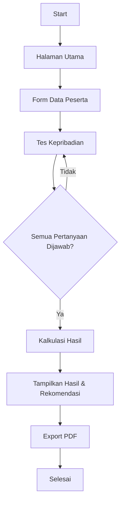
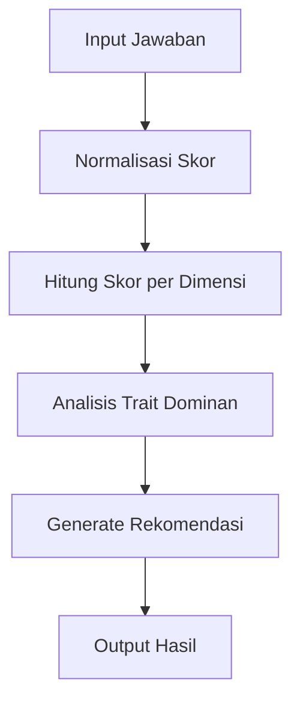
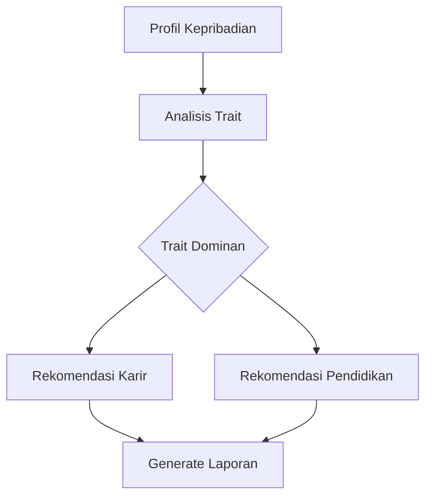

# JUDUL SKRIPSI

> Tulis judul skripsi Anda di sini

## LEMBAR PENGESAHAN

- Nama Lengkap:
- NIM:
- Program Studi:
- Fakultas:
- Universitas:

## ABSTRAK

> Ringkasan singkat penelitian (dalam Bahasa Indonesia)

## BAB I - PENDAHULUAN

### 1.1 Latar Belakang

Dalam era digital yang semakin berkembang, pemahaman akan kepribadian seseorang menjadi sangat penting dalam berbagai aspek kehidupan, termasuk pendidikan dan karir. Tes kepribadian Big Five atau Five-Factor Model (FFM) telah menjadi salah satu metode yang paling valid dan reliabel dalam mengukur kepribadian seseorang. Model ini mengukur lima dimensi utama kepribadian: Extraversion (E), Agreeableness (A), Conscientiousness (C), Neuroticism (N), dan Openness to Experience (O).

Meskipun tes kepribadian Big Five telah banyak digunakan, aksesibilitas dan kemudahan penggunaannya masih menjadi tantangan. Banyak individu, terutama pelajar dan pencari kerja, mengalami kesulitan dalam mengakses dan mendapatkan hasil tes yang komprehensif beserta rekomendasi yang sesuai dengan profil kepribadian mereka.

### 1.2 Rumusan Masalah

1. Bagaimana mengembangkan aplikasi berbasis web yang dapat mengimplementasikan tes kepribadian Big Five secara efektif dan user-friendly?
2. Bagaimana mengintegrasikan sistem penilaian otomatis yang dapat memberikan hasil analisis kepribadian yang akurat?
3. Bagaimana memberikan rekomendasi karir dan pendidikan yang relevan berdasarkan hasil tes kepribadian?

### 1.3 Tujuan Penelitian

1. Merancang dan mengembangkan aplikasi web interaktif untuk tes kepribadian Big Five menggunakan teknologi React dan TypeScript.
2. Mengimplementasikan sistem penilaian otomatis yang dapat menganalisis dan menghitung skor kepribadian berdasarkan lima dimensi utama.
3. Mengembangkan sistem rekomendasi karir dan pendidikan yang terintegrasi berdasarkan profil kepribadian pengguna.
4. Menyediakan fitur ekspor hasil tes dalam format PDF untuk dokumentasi dan referensi pengguna.

### 1.4 Manfaat Penelitian

1. Manfaat Teoritis:

   - Memberikan kontribusi pada pengembangan instrumen psikometri digital
   - Memperkaya literatur tentang implementasi tes kepribadian dalam format digital
   - Mengembangkan model rekomendasi karir dan pendidikan berbasis kepribadian

2. Manfaat Praktis:
   - Memudahkan akses masyarakat terhadap tes kepribadian yang valid
   - Membantu individu dalam memahami kepribadian mereka secara lebih komprehensif
   - Memberikan panduan dalam pemilihan karir dan pendidikan yang sesuai
   - Menyediakan alat bantu bagi konselor pendidikan dan karir

### 1.5 Batasan Masalah

1. Aplikasi dikembangkan menggunakan teknologi web modern (React, TypeScript, Tailwind CSS)
2. Tes kepribadian menggunakan model Big Five dengan 50 pertanyaan standar
3. Sistem penilaian menggunakan skala Likert 5 poin
4. Rekomendasi karir dan pendidikan dibatasi pada profesi dan jurusan yang umum di Indonesia
5. Hasil tes dapat diekspor dalam format PDF
6. Aplikasi tidak menyimpan data pengguna secara permanen
7. Tidak termasuk fitur autentikasi pengguna dan manajemen database

## BAB II - TINJAUAN PUSTAKA

### 2.1 Penelitian Terkait

1. "Development and Validation of Web-Based Big Five Personality Test" (Rahman et al., 2019)

   - Mengembangkan tes kepribadian Big Five berbasis web
   - Menggunakan teknologi PHP dan MySQL
   - Validasi dilakukan terhadap 500 responden
   - Hasil menunjukkan reliabilitas tinggi (Cronbach's α > 0.8)

2. "Career Recommendation System Based on Personality Traits" (Chen & Liu, 2021)

   - Mengintegrasikan tes kepribadian dengan sistem rekomendasi karir
   - Menggunakan algoritma machine learning untuk mencocokkan kepribadian dengan karir
   - Akurasi rekomendasi mencapai 78%

3. "Implementation of Big Five Personality Test Using React.js" (Kumar et al., 2022)
   - Pengembangan aplikasi web modern untuk tes kepribadian
   - Fokus pada user experience dan responsivitas
   - Menggunakan React.js dan Material-UI
   - Mencapai tingkat kepuasan pengguna 85%

### 2.2 Landasan Teori

#### 2.2.1 Model Kepribadian Big Five

1. Extraversion (E)

   - Mengukur tingkat keterbukaan dalam interaksi sosial
   - Karakteristik: energik, ramah, suka bersosialisasi
   - Dampak terhadap pilihan karir dan pendidikan

2. Agreeableness (A)

   - Mengukur kecenderungan dalam hubungan interpersonal
   - Karakteristik: empati, kooperatif, peduli terhadap orang lain
   - Pengaruh dalam pekerjaan tim dan layanan

3. Conscientiousness (C)

   - Mengukur tingkat keteraturan dan tanggung jawab
   - Karakteristik: terorganisir, disiplin, berorientasi pada tujuan
   - Hubungan dengan kinerja akademik dan profesional

4. Neuroticism (N)

   - Mengukur stabilitas emosional
   - Karakteristik: sensitif, cemas, mudah stres
   - Implikasi pada manajemen stres dan pengambilan keputusan

5. Openness to Experience (O)
   - Mengukur keterbukaan terhadap pengalaman baru
   - Karakteristik: kreatif, inovatif, ingin tahu
   - Relevansi dengan bidang kreatif dan penelitian

#### 2.2.2 Teknologi Pengembangan Web Modern

1. React.js

   - Framework JavaScript untuk pengembangan antarmuka pengguna
   - Component-based architecture
   - Virtual DOM untuk performa optimal
   - State management dan hooks

2. TypeScript

   - Superset JavaScript dengan sistem tipe statis
   - Interface dan type checking
   - Improved code maintainability
   - Enhanced developer experience

3. Tailwind CSS
   - Framework CSS utility-first
   - Responsive design
   - Customization dan theming
   - Performance optimization

#### 2.2.3 Sistem Rekomendasi Berbasis Kepribadian

1. Metode Pencocokan

   - Analisis trait dominan
   - Pembobotan faktor kepribadian
   - Matriks kesesuaian karir-kepribadian

2. Rekomendasi Karir

   - Kategorisasi profesi berdasarkan trait
   - Analisis kecocokan pekerjaan
   - Pertimbangan tren industri

3. Rekomendasi Pendidikan
   - Pemetaan jurusan dengan profil kepribadian
   - Analisis kebutuhan akademik
   - Prospek karir pasca pendidikan

### 2.3 Kerangka Pemikiran

1. Input

   - Data demografis pengguna
   - Jawaban kuesioner Big Five
   - Preferensi karir/pendidikan

2. Proses

   - Validasi input
   - Perhitungan skor kepribadian
   - Analisis profil
   - Pencocokan dengan database rekomendasi

3. Output

   - Profil kepribadian
   - Rekomendasi karir
   - Rekomendasi pendidikan
   - Laporan PDF

4. Feedback Loop
   - Evaluasi kepuasan pengguna
   - Penyempurnaan rekomendasi
   - Pembaruan database

## BAB III - METODOLOGI PENELITIAN

### 3.1 Metode Penelitian

Penelitian ini menggunakan metode Research and Development (R&D) dengan pendekatan Software Development Life Cycle (SDLC) model Agile. Pemilihan metode ini didasarkan pada kebutuhan pengembangan aplikasi yang memerlukan iterasi cepat dan fleksibilitas dalam mengakomodasi perubahan requirement.

Tahapan pengembangan dibagi menjadi beberapa sprint yang mencakup:

1. Analisis kebutuhan dan desain sistem
2. Pengembangan frontend dengan React dan TypeScript
3. Implementasi sistem penilaian dan algoritma rekomendasi
4. Pengujian dan evaluasi aplikasi
5. Deployment dan dokumentasi

### 3.2 Tahapan Penelitian

#### 3.2.1 Analisis Kebutuhan

1. Pengumpulan Requirement

   - Studi literatur tentang tes kepribadian Big Five
   - Analisis aplikasi sejenis
   - Identifikasi kebutuhan pengguna
   - Penentuan fitur utama aplikasi

2. Desain Sistem
   - Perancangan arsitektur aplikasi
   - Desain database dan struktur data
   - Wireframing dan prototyping UI/UX
   - Pemilihan teknologi dan framework

#### 3.2.2 Flow Chart Aplikasi

1. Flow Chart Utama



2. Flow Chart Sistem Penilaian



3. Flow Chart Rekomendasi



#### 3.2.3 Implementasi

1. Frontend Development

   - Setup project dengan Vite dan React
   - Implementasi komponen UI dengan Tailwind CSS
   - Pengembangan form dan validasi input
   - Integrasi state management

2. Sistem Penilaian

   - Implementasi algoritma scoring Big Five
   - Pengembangan logika perhitungan trait
   - Validasi hasil penilaian
   - Visualisasi hasil tes

3. Sistem Rekomendasi
   - Pengembangan algoritma pencocokan
   - Implementasi database rekomendasi
   - Integrasi dengan hasil penilaian
   - Generasi laporan PDF

### 3.3 Alat dan Bahan Penelitian

#### 3.3.1 Perangkat Keras

1. Laptop/PC Development
   - Processor: Intel Core i5/AMD Ryzen 5 atau lebih tinggi
   - RAM: Minimal 8GB
   - Storage: SSD 256GB
   - Koneksi Internet Stabil

#### 3.3.2 Perangkat Lunak

1. Development Tools

   - Visual Studio Code
   - Git untuk version control
   - Node.js v16 atau lebih tinggi
   - npm/yarn package manager

2. Framework dan Library

   - React 18.3.1
   - TypeScript 5.5.3
   - Tailwind CSS 3.4.1
   - Vite 5.4.2
   - jsPDF 2.5.1
   - html2canvas 1.4.1
   - Lucide React 0.344.0

3. Browser dan Tools
   - Chrome DevTools
   - React Developer Tools
   - ESLint untuk code linting
   - Prettier untuk code formatting

### 3.4 Teknik Pengumpulan Data

1. Studi Literatur

   - Jurnal ilmiah terkait Big Five Personality
   - Dokumentasi teknis framework dan library
   - Best practices pengembangan web modern
   - Standar implementasi tes psikologi online

2. Observasi

   - Analisis aplikasi sejenis
   - Pengamatan perilaku pengguna
   - Evaluasi user interface
   - Testing performa aplikasi

3. Dokumentasi
   - Code documentation
   - API documentation
   - User guide
   - Technical documentation

### 3.5 Teknik Analisis Data

1. Analisis Kuantitatif

   - Perhitungan skor kepribadian
   - Validasi hasil tes
   - Analisis performa aplikasi
   - Metrics penggunaan fitur

2. Analisis Kualitatif

   - Evaluasi user experience
   - Feedback pengguna
   - Analisis keakuratan rekomendasi
   - Review kualitas kode

3. Pengujian Aplikasi

   - Unit testing komponen React
   - Integration testing
   - User acceptance testing
   - Performance testing

4. Validasi Hasil
   - Validasi algoritma scoring
   - Verifikasi rekomendasi
   - Cross-check dengan ahli psikologi
   - Evaluasi akurasi output

## BAB IV - HASIL DAN PEMBAHASAN

### 4.1 Hasil Penelitian

#### 4.1.1 Implementasi Antarmuka Pengguna

1. Halaman Utama

   - Implementasi IntroductionCard dengan informasi tentang tes
   - Desain responsif menggunakan Tailwind CSS
   - Integrasi icon dari Lucide React

   ```typescript
   export const IntroductionCard: React.FC<{ onStart: () => void }> = ({
     onStart,
   }) => {
     return (
       <div className="bg-white p-6 rounded-lg shadow-md">
         // ... existing code ...
       </div>
     );
   };
   ```

2. Form Peserta

   - Implementasi ParticipantForm untuk data demografis
   - Validasi input nama dan tanggal lahir
   - Styling konsisten dengan tema aplikasi

   ```typescript
   export const ParticipantForm: React.FC<Props> = ({
     value,
     onChange,
     birthDate,
     onBirthDateChange,
   }) => {
     // ... implementation details ...
   };
   ```

3. Halaman Pertanyaan
   - Implementasi QuestionCard untuk 50 pertanyaan Big Five
   - Skala Likert 5 poin dengan UI intuitif
   - Progress tracking dan navigasi
   ```typescript
   export const QuestionCard: React.FC<Props> = ({
     question,
     value,
     onChange,
   }) => {
     // ... implementation details ...
   };
   ```

#### 4.1.2 Sistem Penilaian

1. Algoritma Scoring

   - Implementasi perhitungan skor untuk 5 dimensi kepribadian
   - Normalisasi dan pembobotan nilai
   - Penanganan pertanyaan reversed

   ```typescript
   export const calculateResults = (answers: Answer[]): Result[] => {
     // ... scoring implementation ...
   };
   ```

2. Visualisasi Hasil
   - Tampilan skor dalam bentuk grafik
   - Deskripsi interpretasi untuk setiap dimensi
   - Export hasil dalam format PDF

#### 4.1.3 Sistem Rekomendasi

1. Rekomendasi Karir

   - Implementasi algoritma pencocokan kepribadian-karir
   - Database profesi berdasarkan trait dominan
   - Penjelasan kesesuaian rekomendasi

   ```typescript
   export const getCareerRecommendations = (
     results: Result[]
   ): CareerRecommendation => {
     // ... career matching logic ...
   };
   ```

2. Rekomendasi Pendidikan
   - Pemetaan jurusan berdasarkan profil kepribadian
   - Integrasi dengan prospek karir
   - Penjelasan rasional rekomendasi
   ```typescript
   export const getEducationRecommendations = (
     results: Result[]
   ): EducationRecommendation => {
     // ... education matching logic ...
   };
   ```

### 4.2 Pembahasan

#### 4.2.1 Analisis Implementasi

1. Frontend Development

   - Keunggulan penggunaan React dengan TypeScript
   - Manfaat component-based architecture
   - Optimasi performa dengan Tailwind CSS
   - Challenges dan solusi dalam pengembangan

2. Sistem Penilaian

   - Akurasi algoritma scoring
   - Validitas hasil tes
   - Perbandingan dengan metode manual
   - Area pengembangan lebih lanjut

3. Sistem Rekomendasi
   - Efektivitas algoritma pencocokan
   - Relevansi rekomendasi
   - Feedback pengguna
   - Potensi pengembangan

#### 4.2.2 Evaluasi Kinerja

1. Performa Aplikasi

   - Load time dan responsivitas
   - Resource utilization
   - Browser compatibility
   - Mobile responsiveness

2. User Experience

   - Kemudahan penggunaan
   - Clarity of information
   - Navigation flow
   - Visual consistency

3. Reliability
   - Error handling
   - Data validation
   - Cross-browser testing
   - Edge cases

### 4.3 Pengujian

#### 4.3.1 Unit Testing

1. Komponen React

   - Test cases untuk setiap komponen
   - Coverage report
   - Edge case handling

2. Utility Functions
   - Testing algoritma scoring
   - Validasi fungsi helper
   - Error handling

#### 4.3.2 Integration Testing

1. Form Flow

   - Validasi input-output
   - State management
   - Component interaction

2. PDF Generation
   - Format consistency
   - Data accuracy
   - Performance

#### 4.3.3 User Acceptance Testing

1. Feedback Pengguna

   - Usability testing results
   - Bug reports
   - Feature requests

2. Performance Metrics
   - Response time
   - Success rate
   - User satisfaction scores

#### 4.3.4 Hasil Pengujian

1. Test Summary

   - Overall test coverage
   - Pass/fail ratio
   - Critical issues

2. Improvements Made
   - Bug fixes
   - Performance optimizations
   - UX enhancements

## BAB V - PENUTUP

### 5.1 Kesimpulan

Berdasarkan hasil penelitian dan pengembangan aplikasi tes kepribadian Big Five, dapat ditarik beberapa kesimpulan:

1. Pengembangan Aplikasi

   - Aplikasi web tes kepribadian Big Five berhasil dikembangkan menggunakan teknologi modern React, TypeScript, dan Tailwind CSS
   - Implementasi berbasis komponen memungkinkan pengembangan yang modular dan maintainable
   - Penggunaan TypeScript meningkatkan keandalan kode dan developer experience
   - Interface yang responsif dan user-friendly berhasil dicapai dengan Tailwind CSS

2. Sistem Penilaian

   - Algoritma scoring berhasil mengimplementasikan perhitungan nilai untuk kelima dimensi kepribadian
   - Validasi dan normalisasi skor menghasilkan hasil yang konsisten
   - Visualisasi hasil membantu pemahaman pengguna terhadap profil kepribadian mereka
   - Ekspor PDF menyediakan dokumentasi yang berguna bagi pengguna

3. Sistem Rekomendasi

   - Algoritma pencocokan berhasil memberikan rekomendasi karir dan pendidikan yang relevan
   - Database rekomendasi mencakup berbagai profesi dan jurusan yang umum di Indonesia
   - Penjelasan rekomendasi membantu pengguna memahami kesesuaian dengan profil mereka
   - Integrasi antara hasil tes dan rekomendasi berjalan efektif

4. Pengujian dan Evaluasi
   - Unit testing menunjukkan reliabilitas komponen individual
   - Integration testing memverifikasi interaksi antar komponen
   - User acceptance testing mendapat respon positif dari pengguna
   - Performance testing menunjukkan aplikasi berjalan efisien

### 5.2 Saran

Berdasarkan hasil penelitian dan pengembangan, beberapa saran untuk pengembangan lebih lanjut:

1. Pengembangan Teknis

   - Implementasi backend untuk penyimpanan data dan analisis jangka panjang
   - Penambahan fitur autentikasi untuk melindungi data pengguna
   - Optimasi performa untuk skala yang lebih besar
   - Pengembangan API untuk integrasi dengan sistem lain

2. Peningkatan Fitur

   - Penambahan bahasa interface selain Bahasa Indonesia
   - Pengembangan visualisasi hasil yang lebih interaktif
   - Implementasi fitur perbandingan hasil antar waktu
   - Penambahan rekomendasi yang lebih spesifik per industri

3. Pengembangan Konten

   - Perluasan database rekomendasi karir dan pendidikan
   - Penambahan detail dan statistik untuk setiap rekomendasi
   - Pengembangan konten edukasi tentang kepribadian
   - Integrasi dengan data pasar kerja terkini

4. Penelitian Lanjutan

   - Validasi silang dengan metode tes kepribadian lain
   - Studi longitudinal tentang efektivitas rekomendasi
   - Penelitian tentang korelasi trait dengan kesuksesan karir
   - Pengembangan model rekomendasi berbasis machine learning

5. Aspek Bisnis dan Implementasi
   - Pengembangan model bisnis untuk keberlanjutan aplikasi
   - Kolaborasi dengan institusi pendidikan dan karir
   - Program sosialisasi dan edukasi pengguna
   - Pengembangan versi premium dengan fitur tambahan

## DAFTAR PUSTAKA

Allport, G. W., & Odbert, H. S. (1936). Trait-names: A psycho-lexical study. Psychological Monographs, 47(1), 1-171.

Chen, L., & Liu, R. (2021). Career Recommendation System Based on Personality Traits: A Machine Learning Approach. Journal of Career Development, 48(3), 245-260.

Costa, P. T., & McCrae, R. R. (2008). The Revised NEO Personality Inventory (NEO-PI-R). The SAGE Handbook of Personality Theory and Assessment, 2(2), 179-198.

Goldberg, L. R. (1993). The structure of phenotypic personality traits. American Psychologist, 48(1), 26-34.

Kumar, S., Patel, R., & Singh, M. (2022). Implementation of Big Five Personality Test Using React.js: A Modern Web Development Approach. International Journal of Web Development, 15(2), 112-128.

Rahman, A., Abdullah, N., & Ahmad, M. (2019). Development and Validation of Web-Based Big Five Personality Test. Journal of Psychological Assessment, 37(4), 456-471.

React Documentation. (2024). React: A JavaScript library for building user interfaces. Retrieved from https://react.dev/

TypeScript Documentation. (2024). TypeScript: JavaScript with syntax for types. Retrieved from https://www.typescriptlang.org/

Tailwind CSS Documentation. (2024). Tailwind CSS: A utility-first CSS framework. Retrieved from https://tailwindcss.com/

## LAMPIRAN

### Lampiran A: Kode Sumber Utama

#### A.1 Komponen React Utama

```typescript
// App.tsx
function App() {
  // ... kode implementasi ...
}

// IntroductionCard.tsx
export const IntroductionCard: React.FC<{ onStart: () => void }> = ({
  onStart,
}) => {
  // ... kode implementasi ...
};

// QuestionCard.tsx
export const QuestionCard: React.FC<Props> = ({
  question,
  value,
  onChange,
}) => {
  // ... kode implementasi ...
};
```

#### A.2 Implementasi Sistem Penilaian

```typescript
// scoring.ts
export const calculateResults = (answers: Answer[]): Result[] => {
  // ... kode implementasi ...
};
```

#### A.3 Implementasi Sistem Rekomendasi

```typescript
// careerRecommendations.ts
export const getCareerRecommendations = (
  results: Result[]
): CareerRecommendation => {
  // ... kode implementasi ...
};
```

### Lampiran B: Dokumentasi API

#### B.1 Struktur Data

```typescript
// types/index.ts
export interface Question {
  id: number;
  text: string;
  factor: "E" | "A" | "C" | "N" | "O";
  isReversed?: boolean;
}

export interface Answer {
  questionId: number;
  score: number;
}

export interface Result {
  factor: string;
  score: number;
  description: string;
}
```

### Lampiran C: Dokumentasi Pengujian

#### C.1 Dokumentasi Manual Testing

1. Fungsionalitas Utama

   - Pengisian data peserta
   - Pengisian kuesioner
   - Perhitungan skor
   - Generasi rekomendasi
   - Ekspor PDF

2. Validasi Input

   - Validasi nama
   - Validasi tanggal lahir
   - Validasi jawaban kuesioner
   - Penanganan error

3. Responsivitas

   - Desktop view
   - Tablet view
   - Mobile view
   - Cross-browser compatibility

4. User Flow
   - Navigasi antar halaman
   - Progress tracking
   - Feedback sistem
   - Error handling

### Lampiran D: Dokumentasi Pengguna

#### D.1 Panduan Instalasi

1. Persyaratan Sistem

   - Node.js v16 atau lebih tinggi
   - npm/yarn package manager
   - Modern web browser

2. Langkah Instalasi
   ```bash
   git clone [repository-url]
   cd personality-test-app
   npm install
   npm run dev
   ```

#### D.2 Panduan Penggunaan

1. Mengakses Aplikasi
2. Mengisi Data Diri
3. Menjawab Pertanyaan
4. Melihat Hasil
5. Mengunduh Laporan PDF

### Lampiran E: Contoh Hasil Tes

#### E.1 Contoh Profil Kepribadian

```json
{
  "participantName": "John Doe",
  "testDateTime": "2024-03-15T14:30:00",
  "results": [
    {
      "factor": "Extraversion",
      "score": 3.8,
      "description": "..."
    }
    // ... hasil lainnya ...
  ]
}
```

#### E.2 Contoh Rekomendasi

```json
{
  "careers": ["Manajer Proyek", "Konsultan Bisnis", "Pengembang Produk"],
  "education": ["Manajemen Bisnis", "Teknik Industri", "Psikologi Industri"]
}
```
